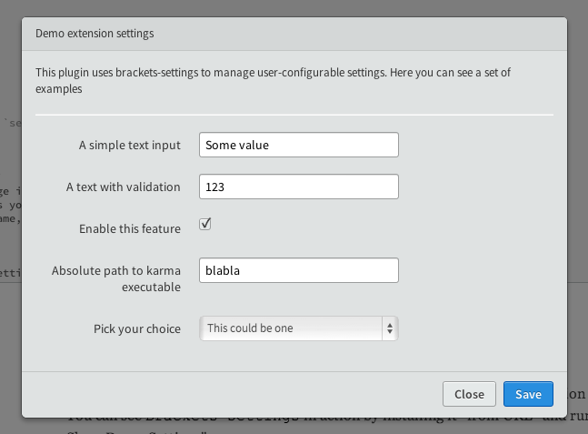

Brackets Settings
==========

This library provide a simple yet powerful interface and UI to manage extension settings.
You can see `Brackets Settings` in action by installing it "from URL" and running "Help > Show Demo Settings"


##Usage

You need to download `lib/settings.js` and `htmlContent/settings.html` in the respective folder inside your extension. If you use a different tree structure
make sure to fix the `require` accordingly.

Inside your `main.js`  require `lib/settings.js` which exports the `Settings` class, and inside the `AppInit`  method you can do something like this:

```javascript
settings = new Settings('your.settings.id', [{
                type: 'input',
                name: 'a_text',
                title: 'A simple text input',
                default: 'Some value'
            },{
                type: 'boolean',
                name: 'a_flag',
                title: 'Enable this feature',
                default: true,
            }], 'Your extension name');
```

and then, when you want to show up the modal dialog `settings.show();` which returns a promise, resolved when the modal is closed.

##Settings API

* `new Settings(extensionId, config, extensionName)`
 extensionId (string): The preference manager storage id (a namespaced string identifying your extension)
 config (Array): An array of describing the settings you want to control
 extensionName (string - optional): The extension name, used inside the UI modal dialog
 
 
 * `Settings#show()`: display the modal dialog
 * `Settings#get(setting)`: returns the requested setting
 * `Settings#getAll()`: returns all the settings
 
 
 ##Configuration Array
 
 The `Settings` constructor expect a config array. Each config object MUST provide a `type` property. Other properties depends on the specific type.
 
 ###Supported `type`s

####`input` 
Display a simple input text with optional validation feature.

```javascript
{
    type: 'input',
    name: 'a_text', //the setting identifier
    title: 'A simple text input', //Description (shown to the user)
    default: 'Some value', //(optional) Default value
    validator: function (value, $input, $dialog) {} //A function that can validate (and eventually modify) the input. 
}
```

####`boolean`
Display a checkbox

```javascript
{
    type: 'boolean',
    name: 'a_text', //string - the setting identifier
    title: 'A simple text input', //string - Description (shown to the user)
    default: true, //boolean (optional) - Default value
}
```

####`select`
Display a select box

```javascript
{
    type: 'separator',
    name: 'a_text', //the setting identifier
    title: 'A simple text input', //Description (shown to the user)
    options: [{
            title: 'This could be one',
            value: 'one'
        }, {
            title: 'This is the default choice',
            value: 'two',
            default: true
        }, {
            title: 'Yet another option',
            value: 'three'
        }]
    
}
```

####`separator`
Renders a simple horizontal separator

```javascript
{
    type: 'separator'
}
```

####`text`


```javascript
{
    type: 'text', 
    title: 'This is a simple text' //string - a simple text to display
}
```
 
##Contribution

Please feel free to submit issues and pull-requests. In case of PR try to keep the code-style consistent and mantain the sources jshintable.

Licens: MIT